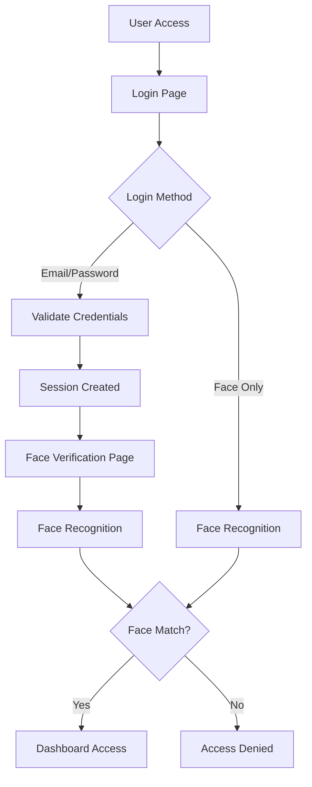

# Secure Authentication System

A comprehensive two-factor authentication system combining traditional email/password login with advanced face recognition technology using DeepFace and Flask.

## 🚀 Features

- **Dual Authentication**: Email/password + Face recognition
- **Secure Password Hashing**: Using bcrypt for password security
- **Face Recognition**: Advanced AI-powered face verification using DeepFace
- **Session Management**: Secure session handling with Flask sessions
- **Responsive UI**: Modern, mobile-friendly interface
- **Database Integration**: MySQL database for user management
- **Real-time Camera**: Live camera feed for face capture
- **Error Handling**: Comprehensive error handling and user feedback

## 📋 Table of Contents

- [System Architecture](#system-architecture)
- [Installation & Setup](#installation--setup)
- [API Documentation](#api-documentation)
- [Database Schema](#database-schema)
- [Frontend Components](#frontend-components)
- [Security Features](#security-features)
- [Testing Guide](#testing-guide)
- [Deployment](#deployment)
- [Troubleshooting](#troubleshooting)
- [Contributing](#contributing)

## 🏗️ System Architecture

### High-Level Architecture

```
┌─────────────────┐    ┌─────────────────┐    ┌─────────────────┐
│   Frontend      │    │   Flask App     │    │   Database      │
│   (HTML/JS)     │◄──►│   (Python)      │◄──►│   (MySQL)       │
└─────────────────┘    └─────────────────┘    └─────────────────┘
         │                       │                       │
         │                       │                       │
         ▼                       ▼                       ▼
┌─────────────────┐    ┌─────────────────┐    ┌─────────────────┐
│   Camera API    │    │   DeepFace      │    │   File System   │
│   (WebRTC)      │    │   (AI Models)   │    │   (Face Images) │
└─────────────────┘    └─────────────────┘    └─────────────────┘
```

### Technology Stack

- **Backend**: Flask (Python)
- **Database**: MySQL
- **AI/ML**: DeepFace (TensorFlow backend)
- **Frontend**: HTML5, CSS3, JavaScript (ES6+)
- **Camera**: WebRTC (getUserMedia API)
- **Security**: bcrypt, Flask sessions
- **Image Processing**: PIL (Pillow), OpenCV

### Authentication Flow



## 🛠️ Installation & Setup

### Prerequisites

- Python 3.8+
- MySQL 5.7+
- Webcam/Camera
- Modern web browser (Chrome, Firefox, Safari, Edge)

### 1. Clone Repository

```bash
git clone <repository-url>
cd SecureAuthentication
```

### 2. Install Python Dependencies

```bash
pip install -r requirements.txt
```

**Required Packages:**
- Flask==2.3.3
- flask-cors
- mysql-connector-python
- bcrypt
- deepface
- opencv-python
- numpy
- pillow

### 3. Database Setup

#### Create MySQL Database

```sql
CREATE DATABASE secure;
USE secure;

CREATE TABLE users (
    id INT AUTO_INCREMENT PRIMARY KEY,
    username VARCHAR(255) NOT NULL UNIQUE,
    email VARCHAR(255) NOT NULL UNIQUE,
    password VARCHAR(255) NOT NULL,
    image_path VARCHAR(500),
    created_at TIMESTAMP DEFAULT CURRENT_TIMESTAMP
);
```

#### Configure Database Connection

Update `app.py` database configuration:

```python
db_config = {
    "host": "localhost",
    "user": "your_username",
    "password": "your_password",
    "database": "secure"
}
```

### 4. Directory Structure Setup

```bash
mkdir -p faces static/faces
```

### 5. Run Application

```bash
python app.py
```

The application will be available at `http://127.0.0.1:5000`

## 📚 API Documentation

### Authentication Endpoints

#### 1. User Registration

**Endpoint:** `POST /register`

**Request Body:**
```json
{
    "username": "string",
    "email": "string", 
    "password": "string",
    "face_image_base64": "data:image/jpeg;base64,..."
}
```

**Response:**
```json
{
    "status": "success|error",
    "message": "string"
}
```

**Status Codes:**
- `200`: Registration successful
- `400`: Missing fields or invalid data
- `500`: Server error

#### 2. Email/Password Login

**Endpoint:** `POST /login_email`

**Request Body:**
```json
{
    "email": "string",
    "username": "string",
    "password": "string"
}
```

**Response:**
```json
{
    "status": "success|error",
    "message": "string",
    "redirect": "/loginface"
}
```

**Status Codes:**
- `200`: Login successful
- `400`: Invalid input
- `401`: Invalid credentials
- `500`: Server error

#### 3. Face Recognition Login

**Endpoint:** `POST /login_face`

**Request Body:**
```json
{
    "username": "string",
    "face_image_base64": "data:image/jpeg;base64,..."
}
```

**Response:**
```json
{
    "status": "success|error",
    "message": "string"
}
```

**Status Codes:**
- `200`: Face recognized
- `400`: Invalid input
- `401`: Face not recognized
- `404`: User not found
- `500`: Server error

### Page Endpoints

#### 1. Home/Login Page
**Endpoint:** `GET /`
**Response:** HTML page (login.html)

#### 2. Registration Page
**Endpoint:** `GET /register`
**Response:** HTML page (register.html)

#### 3. Face Verification Page
**Endpoint:** `GET /loginface`
**Response:** HTML page (loginface.html)
**Authentication:** Requires session

#### 4. Dashboard
**Endpoint:** `GET /dashboard`
**Response:** HTML page (dashboard.html)
**Authentication:** Requires session

#### 5. Face Image Serving
**Endpoint:** `GET /faces/<filename>`
**Response:** Image file or default avatar
**Purpose:** Serves user face images

#### 6. Logout
**Endpoint:** `GET /logout`
**Response:** JSON confirmation
**Purpose:** Clears user session

## 🗄️ Database Schema

### Users Table

```sql
CREATE TABLE users (
    id INT AUTO_INCREMENT PRIMARY KEY,
    username VARCHAR(255) NOT NULL UNIQUE,
    email VARCHAR(255) NOT NULL UNIQUE,
    password VARCHAR(255) NOT NULL,
    image_path VARCHAR(500),
    created_at TIMESTAMP DEFAULT CURRENT_TIMESTAMP
);
```

**Field Descriptions:**
- `id`: Primary key, auto-increment
- `username`: Unique username (2+ characters)
- `email`: Unique email address (validated format)
- `password`: bcrypt hashed password
- `image_path`: Path to registered face image
- `created_at`: Account creation timestamp

## 🎨 Frontend Components

### 1. Login Page (`login.html`)

**Features:**
- Email/password form with validation
- Live camera feed for face login
- Responsive design
- Real-time form validation
- Error handling and user feedback

**Key Functions:**
- `startCamera()`: Initialize webcam
- `captureFace()`: Capture face image
- `validateForm()`: Client-side validation
- `loginWithEmail()`: Email/password login
- `loginWithFace()`: Face recognition login

### 2. Registration Page (`register.html`)

**Features:**
- User registration form
- Face capture during registration
- Password strength validation
- Email format validation
- Image quality validation

**Key Functions:**
- `startCamera()`: Initialize webcam
- `captureFace()`: Capture and validate face
- `validateForm()`: Form validation
- `registerUser()`: Submit registration

### 3. Face Verification Page (`loginface.html`)

**Features:**
- Dedicated face verification
- High-quality image capture
- Multiple camera constraint attempts
- Retry functionality
- Username parameter handling

**Key Functions:**
- `startCamera()`: Enhanced camera initialization
- `getUsername()`: Get username from URL/session
- `verifyFace()`: Face verification process

### 4. Dashboard (`dashboard.html`)

**Features:**
- User profile display
- Face image display
- User information card
- Logout functionality
- Profile refresh capability

**Key Functions:**
- `refreshProfile()`: Reload profile image
- `updateLoginTime()`: Update timestamp
- Error handling for missing images

## 🔒 Security Features

### 1. Password Security
- **Hashing**: bcrypt with salt
- **Validation**: Minimum length requirements
- **Storage**: Never store plain text passwords

### 2. Session Management
- **Flask Sessions**: Secure session handling
- **Session Validation**: Required for protected routes
- **Automatic Cleanup**: Session clearing on logout

### 3. Input Validation
- **Server-side**: Comprehensive validation on all endpoints
- **Client-side**: Real-time form validation
- **Email Format**: Regex validation
- **Image Validation**: Size and format checks

### 4. Face Recognition Security
- **Multiple Models**: VGG-Face, Facenet, ArcFace
- **Multiple Backends**: OpenCV, RetinaFace, MTCNN
- **Distance Metrics**: Cosine similarity
- **Fallback Options**: Multiple verification attempts

### 5. Error Handling
- **Graceful Degradation**: Fallbacks for missing components
- **User-friendly Messages**: Clear error communication
- **Logging**: Comprehensive error logging
- **Security**: No sensitive data in error messages

## 🧪 Testing Guide

### 1. Manual Testing

#### Registration Flow
1. Navigate to `/register`
2. Fill in user details
3. Capture face image
4. Submit registration
5. Verify success message

#### Login Flow
1. Navigate to `/`
2. Enter credentials
3. Complete face verification
4. Access dashboard
5. Verify user data display

#### Face Recognition Testing
1. Test with same person (should succeed)
2. Test with different person (should fail)
3. Test with poor lighting
4. Test with different angles
5. Test camera permissions

### 2. API Testing

#### Using curl

```bash
# Test registration
curl -X POST http://127.0.0.1:5000/register \
  -F "username=testuser" \
  -F "email=test@example.com" \
  -F "password=testpass" \
  -F "face_image_base64=data:image/jpeg;base64,..."

# Test login
curl -X POST http://127.0.0.1:5000/login_email \
  -F "email=test@example.com" \
  -F "username=testuser" \
  -F "password=testpass"
```

#### Using Python requests

```python
import requests

# Test dashboard access
response = requests.get('http://127.0.0.1:5000/dashboard')
print(f"Status: {response.status_code}")
print(f"Response: {response.text}")
```

### 3. Browser Testing

#### Camera Permissions
- Test camera access in different browsers
- Test HTTPS vs HTTP camera access
- Test camera permission denial

#### Cross-browser Compatibility
- Chrome (recommended)
- Firefox
- Safari
- Edge

## 🚀 Deployment

### 1. Production Configuration

#### Environment Variables
```bash
export FLASK_ENV=production
export SECRET_KEY=your-secure-secret-key
export DB_HOST=your-db-host
export DB_USER=your-db-user
export DB_PASSWORD=your-db-password
```

#### Security Updates
```python
# In app.py
app.secret_key = os.environ.get('SECRET_KEY', 'fallback-key')
app.config['SESSION_COOKIE_SECURE'] = True
app.config['SESSION_COOKIE_HTTPONLY'] = True
```

### 2. Database Production Setup

```sql
-- Create production user
CREATE USER 'auth_user'@'localhost' IDENTIFIED BY 'secure_password';
GRANT SELECT, INSERT, UPDATE ON secure.* TO 'auth_user'@'localhost';
FLUSH PRIVILEGES;
```

### 3. Web Server Configuration

#### Nginx Configuration
```nginx
server {
    listen 80;
    server_name your-domain.com;
    
    location / {
        proxy_pass http://127.0.0.1:5000;
        proxy_set_header Host $host;
        proxy_set_header X-Real-IP $remote_addr;
    }
    
    location /faces/ {
        alias /path/to/your/app/faces/;
    }
}
```

#### Gunicorn Setup
```bash
pip install gunicorn
gunicorn -w 4 -b 0.0.0.0:5000 app:app
```

### 4. SSL/HTTPS Setup

```bash
# Install certbot
sudo apt install certbot python3-certbot-nginx

# Get SSL certificate
sudo certbot --nginx -d your-domain.com
```

## 🔧 Troubleshooting

### Common Issues

#### 1. Camera Not Working
**Symptoms:** Camera doesn't initialize
**Solutions:**
- Check browser permissions
- Use HTTPS in production
- Test with different browsers
- Check camera availability

#### 2. Face Recognition Fails
**Symptoms:** Face verification always fails
**Solutions:**
- Check image quality
- Ensure good lighting
- Verify face is clearly visible
- Check DeepFace installation

#### 3. Database Connection Issues
**Symptoms:** Database errors in logs
**Solutions:**
- Verify MySQL is running
- Check connection credentials
- Test database connectivity
- Verify table structure

#### 4. Session Issues
**Symptoms:** Users logged out unexpectedly
**Solutions:**
- Check secret key configuration
- Verify session storage
- Check browser cookie settings
- Test session persistence

### Debug Mode

Enable debug mode for development:

```python
if __name__ == "__main__":
    app.run(debug=True, host='0.0.0.0', port=5000)
```

### Logging

Add comprehensive logging:

```python
import logging
logging.basicConfig(level=logging.DEBUG)
logger = logging.getLogger(__name__)

# In your functions
logger.info("User login attempt: %s", username)
logger.error("Database error: %s", str(e))
```

## 📊 Performance Optimization

### 1. Database Optimization
- Add indexes on frequently queried columns
- Use connection pooling
- Implement query caching

### 2. Image Processing
- Compress images before storage
- Implement image caching
- Use CDN for image delivery

### 3. Face Recognition
- Cache model loading
- Optimize image preprocessing
- Use GPU acceleration if available

## 🤝 Contributing

### Development Setup
1. Fork the repository
2. Create a feature branch
3. Make your changes
4. Add tests
5. Submit a pull request

### Code Style
- Follow PEP 8 for Python
- Use meaningful variable names
- Add docstrings to functions
- Include error handling

### Testing Requirements
- Test all new features
- Maintain test coverage
- Test cross-browser compatibility
- Test security implications

## 📄 License

This project is licensed under the MIT License - see the LICENSE file for details.

## 🆘 Support

For support and questions:
- Create an issue on GitHub
- Check the troubleshooting section
- Review the API documentation
- Test with the provided examples

---

**Version:** 1.0.0  
**Last Updated:** September 2025  
**Maintainer:** Development Team
